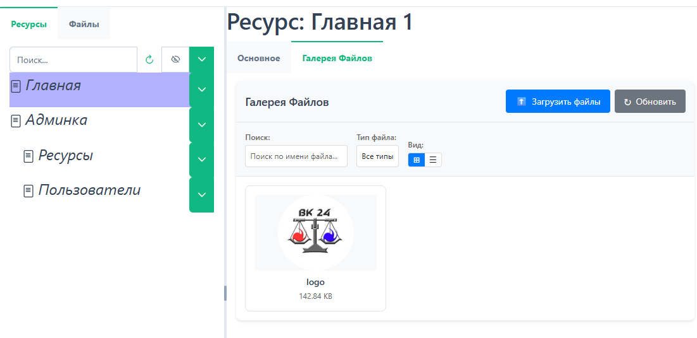
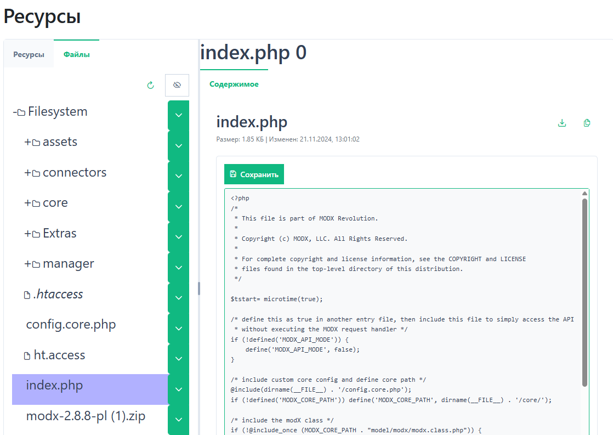
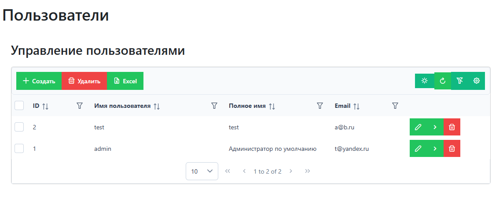

# PVAdmin мини-админка для MODX 2.8

## Обзор
Наконец я добрался до создания админки для MODX. Реализовал только необходимый нам функционал, но при необходимости всё можно доработать — это не очень сложно. В gtsAPI теперь есть все необходимые модули. Также можно использовать эти модули для других проектов.

## Здесь реализованы:
1. Дерево ресурсов MODX.

2. Собственная галерея файлов.

3. Дерево файлов.

4. Управление пользователями.

## Установка
Перед установкой PVAdmin установите gtsAPI (getTables и pdoTools, если они не установлены) и Login. Необходимо настроить ЧПУ MODX. Включить Использовать Fenom на страницах.
Установите пакет [pvadmin-1.0.0-beta.transport.zip](https://github.com/tuniekov/PVAdmin/releases/download/new/pvadmin-1.0.0-beta.transport.zip) из репозитория пакета [PVAdmin](https://github.com/tuniekov/PVAdmin/).

# Важно
gtsAPI работает на MODX 2.8, MySQL 5.7 или последней версии MariaDB, PHP 7.4. На остальных конфигурациях работа не тестировалась.
