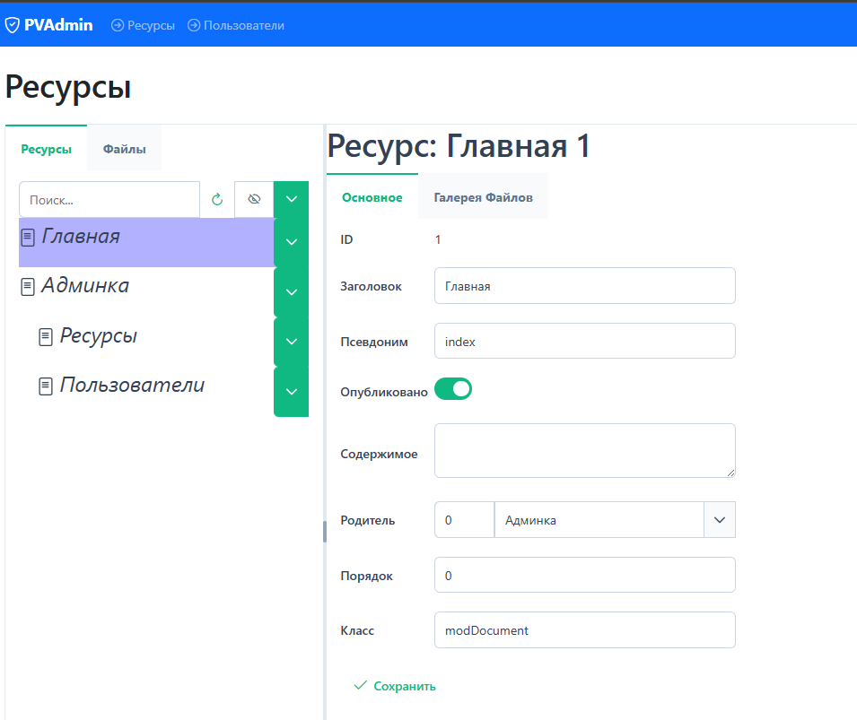

# PVAdmin мини-админка для MODX 2.8

## Обзор
Ну вот я добрался до того чтобы сделать админку для MODX. Реализовал только нужный нам функционал, но при необходимости можно все, не очень сложно, доработать. В gtsAPI теперь есть все необходимые модули. Так же можно использовать эти модули для других проектов.

## Здесь реализованы:
1. Дерево ресурсов MODX.

2. Своя галерея файлов.

3. Дерево файлов.

4. Управление пользователями.

## Установка
Перед установкой PVAdmin, установить gtsAPI(getTables и pdoTools, если не встали) и Login.
Установить пакет pvadmin.transport.zip из репозитория пакета.

# Важно
gtsAPI работает на MODX 2.8, mySQL 5.7 или последняя mariadb, php 7.4. На остальных конфигурациях работа не тестировалась.